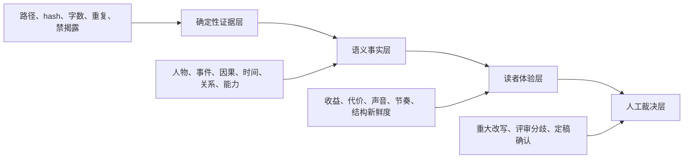

# 中文网文质量与 Humanizer 深化优化架构

> v0.4.0 的字数主导、滚动纲要和可组合题材协议以 [`V0_4_0_WORD_BUDGET_AND_COMPOSABLE_PROFILE_CHECKLIST.md`](V0_4_0_WORD_BUDGET_AND_COMPOSABLE_PROFILE_CHECKLIST.md) 为当前验收源。本文件中早期 `market + genre + phase` 与条件式章节方向描述仅保留为历史设计背景，不再是源码主线协议。

起点主合同、番茄非阻断兼容视图、阶段覆盖、合同解释和真实盲评边界见 [`PLATFORM_WRITING_ADAPTATION_CHECKLIST.md`](PLATFORM_WRITING_ADAPTATION_CHECKLIST.md)。平台工程能力完成不等于推荐效果或文学质量已经得到证明。

人物表现合同、章节人物包、场景化章节职责、对白可交换诊断和人物编辑的独立验收见 [`CHARACTER_EXPRESSION_AND_SCENE_NARRATIVE_CHECKLIST.md`](CHARACTER_EXPRESSION_AND_SCENE_NARRATIVE_CHECKLIST.md)。工程能力与真实 15 章质量证据必须分别标记。

章节关系、伏笔、角色记忆、TCS、检索索引和中间产物生命周期已收敛到 [`SEMANTIC_KNOWLEDGE_AND_ARTIFACT_COMPACTION.md`](SEMANTIC_KNOWLEDGE_AND_ARTIFACT_COMPACTION.md)；新生产链在 finalize 后执行统一语义 apply 和 chapter close。

## 1. 文档状态

- 状态：分阶段实施中；Phase 1-5 已实现，Phase 6 的正式证据协议、盲评编排与 production-model RAG runner 已实现。Codex 当前协议已完成 15 章受控原创生产，但同模型 `novel-skill` 对照、Claude 外部宿主实跑、三名独立评审和 500 章生产模型证据仍待完成。
- 适用项目：`longform-novel-engine`。
- 目标宿主：Codex App、Codex CLI、Claude Code。
- 默认工作模式：`writing.mode = agent_skill`。
- 关联验收：
  - [`CHINESE_WEBNOVEL_AND_FANFICTION_QUALITY_CHECKLIST.md`](CHINESE_WEBNOVEL_AND_FANFICTION_QUALITY_CHECKLIST.md)
  - [`NOVEL_SKILL_SUPERIORITY_CHECKLIST.md`](NOVEL_SKILL_SUPERIORITY_CHECKLIST.md)
  - [`QUALITY_BENCHMARK_RUNBOOK.md`](QUALITY_BENCHMARK_RUNBOOK.md)
  - [`PHASE6_QUALITY_PROOF_RUNBOOK.md`](PHASE6_QUALITY_PROOF_RUNBOOK.md)
  - [`benchmarks/PHASE6_EXECUTION_STATUS.md`](benchmarks/PHASE6_EXECUTION_STATUS.md)

本文档将当前中文网文质量、去 AI 味、读者体验、编辑团队和长期一致性方面的缺口，收敛为可实施的任务协议、CLI 生命周期、状态边界、编排顺序、测试计划和验收门槛。

本文档中的“去 AI 味”不是规避检测器，也不是机械删除高频词，而是减少安全、中性、解释过度、角色同质、因果过整齐、细节失真和结构可预测等影响阅读体验的问题。

## 2. 当前基线

当前已经实现的基础能力包括：

- `AgentTaskManifest` 明确输入文件、允许输出、schema、validate、apply、失败命令和上下文预算。
- 正文、修章、Humanizer、图谱、记忆、编辑、节奏和语义审稿均使用 Agent 输出候选、CLI 校验和显式 apply/finalize。
- Humanizer v3 已检查空文本、模板表达、信息轰炸、流水账升级、情绪标签、意义膨胀、重复段落、等长句、数字漂移、角色名消失和大幅改写。
- Humanizer v4 Phase 1 已实现独立 `humanize_semantic_review`：双稿 hash/span、声明引用、实体 ID、七类事实、章节合同和人物声音由 CLI 严格校验。
- Phase 2 已实现独立 `reader_payoff_review`：当前 draft hash、章节卡计划、精确证据 span、真实收益/代价、承诺进度和伪兑现 finding 由 CLI 严格校验。
- `reader_reward_entry_v2` 区分 planned 与 observed；未经过语义审稿的 light-mode 章节会明确标记 `observation_status=not_required`，不会伪造 observed 结论。
- finalize 在同一事务中写入 final、收益账本与 `30_state/quality/structure_history.jsonl`；图谱、角色当前状态、伏笔、TCS、RAG 和 SQLite 延后到独立的统一语义事务。
- 章节卡已经包含 `chapter_duty`、`reader_gain`、`cost`、`topology_id`、`hook_mode`、`promise_refs` 和禁揭露约束。
- 高风险章节支持 Agent semantic review，并校验正文 span、canonical 引用和实体 ID。
- gate、repair、Humanizer、pacing 和 editorial 结果能够压缩回流下一章。
- final、RAG、graph、TCS、Bible、outline 和 SQLite 只能由 CLI 受控写入。

当前尚未解决或尚未得到真实证据的问题包括：

- Humanizer 的确定性检查仍以词表和统计特征为主。
- Humanizer 语义审稿协议已经覆盖行为主体、事件结果、因果、时间、关系、能力代价和禁揭露，但真实 Agent 的识别准确率尚未通过盲评证明。
- 风格档案已叠加用户批准的 prose-free 结构观察，但真实题材迁移效果仍需盲评。
- 平台、题材、作品阶段和用户批准风格已形成可组合合同；其阈值和正文收益仍需真实连续章节校准。
- 收益验真协议与结构重复门禁已经存在，但真实 Agent 的收益判断准确率和误报率尚未通过 5/10 章盲评证明。
- 结构观察已覆盖最近 10-20 章，但其阈值仍需用真实多题材连续章节校准。
- 编辑团队已具备风险选角、角色上下文 digest、v2 独立性声明和分歧矩阵；真实跨宿主独立性仍需 benchmark 证据。
- feedback 已具备稳定 ID、解决/抑制状态、复发计数、P2 TTL、P1 无复发解决和最多五条回流；阈值仍需连续章节校准。
- 本地向量查询仍需要线性计算候选相似度。
- 真实 5/10 章盲评和“真实中文章节 + 正式 embedding/reranker”RAG 指标仍未完成；Phase 5 的 50/200/500 章固定向量工程基准已完成，但不得替代生产模型证据。

## 3. 目标与非目标

### 3.1 目标

1. 将质量判断拆分为可复核事实、语义一致性、读者体验和人工裁决四层。
2. 将 Humanizer 从“表达清理”升级为“表达清理 + 事实保护 + 人物声音保护”。
3. 将章节收益从计划字段升级为正文证据支持的实际兑现记录。
4. 允许不同平台、题材和作品阶段采用不同节奏、对白和结尾策略。
5. 检查连续章节的结构重复，而不是强迫每章随机变化。
6. 恢复 `novel-skill` 中有价值的多轮脑洞和章节方向选择体验。
7. 让编辑意见具备上下文隔离、分歧保留和可追踪解决状态。
8. 用同宿主、同模型、同设定的真实基准决定是否允许公开质量声明。

### 3.2 非目标

- 不恢复 Python 脚本内 LLM provider。
- 不要求 OpenAI、Anthropic 或其他 provider API key。
- 不让 Agent 直接写 final、RAG、graph、TCS、Bible、outline 或 SQLite。
- 不自动 finalize。
- 不把平台经验写成所有小说必须遵守的绝对文学规律。
- 不以通过 AI 检测器作为质量目标。
- 不用单元测试代替真实章节盲评。

## 4. 四层质量模型



### 4.1 阻断策略

默认阻断：

- 正文为空或包含 prompt/meta 污染。
- 文件 hash、证据 span 或 canonical 引用无效。
- 事实、人物、关系、时间、能力边界发生未声明变化。
- 提前泄露禁揭露内容或闭合受保护长线矛盾。
- Agent 输出越界或试图直接写 canonical state。
- P0/P1 连贯性问题。

默认建议：

- 高频 AI 词、句长均匀、弱钩子、对白不足。
- 平台画像偏离。
- 单章拓扑与前章相似。
- 收益较弱但章节职责允许铺垫或余波。

升级阻断：

- 同一 P2 问题连续复发。
- 多项结构、语言和收益问题在同一章聚集。
- Agent 通过换词规避表面规则，但语义问题仍存在。
- 多个独立评审对 P1 问题结论冲突。

## 5. Humanizer v4

### 5.1 设计原则

Humanizer 写作者和 Humanizer 审稿者必须分离。写作者只输出润色候选；审稿者比较原稿、候选稿和声明的 canonical 约束。CLI 不判断文学优劣，但负责校验任务范围、hash、span、实体和结论生命周期。

### 5.2 新增任务类型

新增 `humanize_semantic_review`：

- 角色：Humanizer 语义保真审稿者。
- scope：`chapter`。
- 输入上限：6 个文件、28,000 字符。
- 必读：
  - Humanizer 原稿。
  - Humanizer 候选稿。
  - 当前章节卡。
  - 当前风格合同或角色声音摘要。
- 按需读取：
  - 当前章节 TCS。
  - 本章相关角色记忆。
- 禁止读取：
  - 未声明 research inbox。
  - 其他候选稿。
  - 其他项目。
  - 非 manifest 声明的原作正文。
- 允许输出：
  - `50_workbench/humanizer_tasks/chNNN.semantic_review.json`
- 输出 schema：
  - `humanizer_semantic_review_v1`
- validate：
  - `longform-engine creative humanize-semantic-validate project.yaml --chapter N --file <result>`
- apply：
  - 通过后执行工作单声明的 `longform-engine draft submit ...`
- failure：
  - `longform-engine creative humanize-task project.yaml --chapter N --source <source>`

### 5.3 建议 schema

```json
{
  "schema": "humanizer_semantic_review_v1",
  "chapter_number": 1,
  "source": {
    "path": "40_manuscript/draft/ch001.md",
    "sha256": "..."
  },
  "candidate": {
    "path": "50_workbench/repair_candidates/ch001.humanized_candidate.md",
    "sha256": "..."
  },
  "verdict": "pass",
  "fact_preservation": [
    {
      "dimension": "actor_action_object",
      "status": "preserved",
      "source_span": {"start": 0, "end": 10, "text": "..."},
      "candidate_span": {"start": 0, "end": 9, "text": "..."},
      "canonical_refs": ["10_bible/characters.json"],
      "entity_ids": ["char:protagonist"],
      "message": "..."
    }
  ],
  "chapter_contract": {
    "duty_preserved": true,
    "reader_gain_preserved": true,
    "cost_preserved": true,
    "forbidden_reveals_preserved": true
  },
  "voice_checks": [
    {
      "character_id": "char:protagonist",
      "status": "preserved",
      "candidate_spans": [],
      "message": "..."
    }
  ],
  "ai_taste_findings": [
    {
      "code": "neutral_narrator_voice",
      "severity": "P2",
      "message": "...",
      "candidate_span": {"start": 0, "end": 12, "text": "..."},
      "recommendation": "..."
    }
  ],
  "confidence": 0.9,
  "notes": ""
}
```

### 5.4 CLI 校验

CLI 必须验证：

- source/candidate 路径与 manifest 完全一致。
- SHA-256 与当前文件一致。
- span 边界合法，`text` 与实际切片一致。
- `canonical_refs` 只引用 manifest 声明文件。
- `entity_ids` 存在于受控 canonical state。
- 规定维度完整，不接受只检查 Agent 自己选择的部分。
- 任一事实维度为 `changed` 时不得自动 submit。
- 任一 P0/P1 finding 必须进入 repair 或 need-human。
- Agent 不得通过 `verdict=pass` 覆盖结构化 finding 的严重度。

### 5.5 触发矩阵

| 场景 | 是否强制语义复核 |
| --- | --- |
| 改写比例低于 15%，仅局部用词 | 默认否 |
| 改写比例 15%-20% | balanced/strict 强制 |
| 改写比例超过 20% | 强制 |
| 重大揭露、关系转折、能力变化 | 强制 |
| 第 1/3/10/30 章、卷首卷末 | 强制 |
| fanfiction | 强制 |
| 用户配置 `strict` | 每次强制 |

## 6. 读者收益验真

### 6.1 问题

章节卡中的 `reader_gain` 是计划，不代表正文已经提供信息、情绪、关系、能力、地位或悬念方面的真实收益。finalize 不能仅根据计划字段把章节标记为完成兑现。

### 6.2 已实现任务

新增 `reader_payoff_review`：

- 角色：读者收益审稿者。
- scope：`chapter`。
- 输入上限：6 个文件、20,000 字符。
- 必读：
  - 当前待定稿正文。
  - 章节卡。
  - 相关承诺/伏笔摘要。
- 按需读取：
  - 上一章收益记录。
  - 当前平台质量合同。
- 允许输出：
  - `50_workbench/quality_reviews/chNNN.reader_payoff.json`
- schema：
  - `reader_payoff_review_v1`
- validate：
  - `longform-engine quality payoff-validate project.yaml --chapter N --file <result>`
- apply：
  - `longform-engine chapter finalize project.yaml --chapter N --approved-by human`
- failure：
  - 生成 repair task 或 `editorial need-human`。

### 6.3 建议 schema

```json
{
  "schema": "reader_payoff_review_v1",
  "chapter_number": 1,
  "source_path": "40_manuscript/draft/ch001.md",
  "source_hash": "...",
  "planned": {
    "chapter_duty": "...",
    "reader_gain": "...",
    "cost": "...",
    "promise_refs": []
  },
  "observed": {
    "duty_fulfilled": true,
    "reader_gain": "...",
    "cost": "...",
    "promise_progress": [],
    "ending_mode": "decision"
  },
  "evidence_spans": [],
  "fake_payoff_flags": [],
  "craft_observation": {
    "opening_mode": "action",
    "topology_id": "conflict_escalation",
    "ending_mode": "decision",
    "scene_count": 1,
    "dominant_scene_type": "negotiation",
    "reader_gain_position": "ending",
    "dialogue_acts": ["probe", "deflect", "threaten"],
    "emotional_curve": ["guarded", "pressured", "committed"]
  },
  "verdict": "pass",
  "recommendations": []
}
```

### 6.4 `reader_reward_entry_v2`

finalize 事务成功后写入：

```json
{
  "schema": "reader_reward_entry_v2",
  "chapter_number": 1,
  "planned_gain": "...",
  "observed_gain": "...",
  "duty_fulfilled": true,
  "planned_cost": "...",
  "observed_cost": "...",
  "promise_progress": [],
  "evidence_source_hash": "...",
  "evidence_spans": [],
  "topology_id": "conflict_escalation",
  "ending_mode": "decision",
  "observation_status": "semantic_reviewed",
  "finalized": true
}
```

未 finalize 的 payoff review 只能存在于 workbench，不得写入正式收益账本。validation report
额外绑定 review JSON 自身 hash，校验通过后替换审稿文件不能复用旧报告。正式账本只保存证据
offset、supports 和来源 hash，不复制正文证据文本。

## 7. 中文平台与题材质量合同

### 7.1 组合规则

```text
effective_quality_contract
= market profile
+ genre profile
+ story phase
+ user-approved style baseline
+ project overrides
```

建议将硬编码平台提示迁移为 wheel 内置资源：

```text
config/quality_profiles/
  markets/
    qidian_male.yaml
    fanqie_free.yaml
    jinjiang_female.yaml
    general_cn.yaml
  genres/
    xuanhuan.yaml
    urban.yaml
    suspense.yaml
    romance.yaml
    history.yaml
  phases/
    opening.yaml
    early_serial.yaml
    stable_serial.yaml
    volume_climax.yaml
    aftermath.yaml
```

### 7.2 合同维度

- 开篇承诺窗口。
- 章节职责分布。
- 信息、能力、关系、地位、情绪收益节奏。
- 升级必须承担的代价。
- 场景进入摩擦。
- 解释密度。
- 对白功能和允许范围。
- 关系变化节奏。
- 伏笔释放窗口。
- 结尾方式分布。
- 慢章、余波章和完整收束章的允许比例。

### 7.3 配置建议

```yaml
quality:
  assurance_mode: balanced
  profile:
    market: qidian_male
    genre: xuanhuan
    phase: auto
    strictness: balanced
  approved_style_baseline:
    chapters: []
    update_requires_human: true
  reader_payoff:
    review_mode: risk_based
    structure_window: 20
    language_similarity_threshold: 0.72
  humanizer:
    semantic_review_mode: risk_based
    semantic_review_change_ratio: 0.15
```

`assurance_mode`：

| 模式 | 行为 |
| --- | --- |
| `light` | 确定性门禁常开，语义任务仅在里程碑和高风险章节触发 |
| `balanced` | 默认；按风险触发 Humanizer 语义复核、payoff 和编辑角色 |
| `strict` | 每次重大候选改写、每章 payoff、高风险完整编辑团队 |

用户批准的风格基线不得由引擎自动扩充。新增批准章节必须显式执行 CLI 命令并记录批准者。

## 8. 反公式化与结构观察

### 8.1 观察窗口

CLI 对最近 10-20 个 final 章节维护以下派生指标：

- 开场方式分布。
- `topology_id` 分布和连续重复。
- 结尾方式分布。
- 场景数量和主要场景类型。
- 主角获得收益的位置。
- 情绪曲线。
- 对白行为分布。
- 高频身体反应和伪细节。
- 句长、段长和对话密度变化。
- n-gram 和段落结构相似度。

### 8.2 判定原则

- 不以“不同”为唯一目标。
- 同一结构承担不同叙事功能时允许重复。
- 单个维度连续重复只产生 warning。
- 结构、语言、收益三类同时重复时升级为 P1。
- 不要求每章悬崖结尾。
- 不要求每章都有战斗、反转或升级。
- 不通过随机换模板制造表面差异。

### 8.3 状态落盘

- Agent craft observation：`50_workbench/quality_reviews/`。
- CLI 验证结果：同目录 validation 文件。
- finalize 后派生历史：`30_state/quality/structure_history.jsonl`。
- 回滚章节时，对应记录必须 stale 或重建。

### 8.4 已实现判定

- `reader_payoff_validate` 对候选章节生成 prose-free 结构指纹。
- 单一 opening/topology/ending/payoff-position 连续重复三章只生成 P2 warning。
- 最近三章同时满足至少两个结构维度重复、语言/段落节奏相似以及收益位置重复时生成 P1。
- P1 不能被 Agent 的 `verdict=pass` 覆盖；修复对象是因果和场景构造，不是随机替换模板。
- 指纹记录句段长度、对白密度、身体反应、伪细节、hash n-gram 和段落形状，不保存正文。
- revision rollback 会按目标章节截断 reward 与 structure 两个派生历史，并在 stale report 记录 rebuilt indexes。

## 9. 创意交互

### 9.1 `book_ideation`

新增项目级任务：

- schema：`book_ideation_candidate_v1`。
- 输出：`50_workbench/intelligence_candidates/book_ideation.project.candidate.json`。
- apply：必须 `--approved-by human`。
- canonical target：`10_bible/creative_decisions.json`。

必须覆盖：

- 目标读者与阅读场景。
- 核心卖点。
- 世界核心规则。
- 主角欲望和缺陷。
- 长期矛盾。
- 卷级升级。
- 结局边界。
- 禁区和不希望出现的套路。

Agent 每轮只问一个核心问题，可给 2-3 个带取舍说明的候选。CLI 只保存用户明确选择或明确提供的答案。

### 9.2 `chapter_direction`

新增章节级任务：

- schema：`chapter_direction_candidate_v1`。
- 每次提供 2-3 个方向。
- 每个方向必须包含：
  - 本章局部收益。
  - 角色代价。
  - 对长期主线的影响。
  - 对伏笔和关系的影响。
  - 主要风险。
- apply：必须由人选择后更新章节卡。

触发条件：

- `guided` 模式。
- 大纲章节目标过于抽象。
- 卷首、卷末或重大转折。
- 连续返修。
- 多条剧情线均可合法推进。

普通稳定章节不强制触发，避免增加每章操作摩擦。

## 10. 编辑团队独立性

### 10.1 风险选角

| 风险 | 默认角色 |
| --- | --- |
| 普通章节 | writing 或 reader-quality，按当前任务复用 |
| AI 味复发 | anti-ai |
| 事实/关系风险 | serial-verifier |
| 卷首卷末、重大兑现 | planning + reader-quality |
| fanfiction | canon-fidelity |
| P0/P1 分歧 | executive + human |

不要求普通章节每次运行全部角色。

### 10.2 独立性字段

`editorial_role_review_v2` 增加：

- `reviewer_instance_id`
- `agent_product`
- `agent_version`
- `context_digest_hash`
- `independence_mode`
- `review_round`
- `confidence`

`independence_mode` 可取：

- `same_host_isolated_context`
- `cross_host`
- `human`
- `unknown`

这些字段用于证据分级，不代表引擎已经验证 Agent 身份。

### 10.3 上下文隔离

- 评审角色只能读取自己的 manifest 输入。
- 提交前不得读取其他角色结果。
- anti-ai 不默认读取规划编辑结论。
- serial-verifier 读取正文和受控状态，不读取其他审美结论。
- planning 读取大纲、章节卡和收益合同，不读取其他角色打分。
- aggregate 阶段才允许读取全部 normalized result。

### 10.4 分歧报告

aggregate 必须输出：

- 一致 findings。
- 冲突 findings。
- 少数派 P0/P1。
- 证据 span 重合度。
- 相同问题的严重度差异。
- 需要人工决定的问题。

不能用简单多数票覆盖带有效证据的少数派 P0/P1。

## 11. Feedback 生命周期

### 11.1 状态机

```text
open -> carried -> resolved
              -> suppressed
              -> expired
```

### 11.2 feedback record

```json
{
  "schema": "quality_feedback_item_v1",
  "feedback_id": "feedback:dialogue_sameness:ch001:001",
  "issue_code": "dialogue_sameness",
  "severity": "P2",
  "scope": "chapter_range",
  "source_chapter": 1,
  "first_seen_chapter": 1,
  "last_seen_chapter": 2,
  "recurrence_count": 2,
  "status": "open",
  "expires_after_chapter": 5,
  "evidence_hash": "...",
  "resolution_evidence": [],
  "owner_task": "humanize:ch002:v1"
}
```

### 11.3 回流规则

- P0 不自动过期。
- P1 连续两章无复发后可由 CLI 标记 resolved。
- P2 默认携带三章。
- 每个任务最多携带五条。
- 按当前任务类型和章节角色筛选相关反馈。
- resolved、suppressed、expired 不进入新工作单。
- 相同 issue code 和相似证据合并，避免重复灌入。
- 仅换词但语义问题复发时增加 `gate_gaming_risk`。

### 11.4 存储边界

- registry：`50_workbench/quality_feedback/registry.jsonl`。
- feedback 是生产指导，不是小说 canonical fact。
- feedback 不直接修改 final、RAG、graph、TCS 或 SQLite。
- benchmark 可记录数量和复发率，不保存正文。

## 12. RAG 规模优化

### 12.1 当前策略

保留 SQLite 作为向量元数据、状态、章节、实体和 stale 标记的事实来源。小规模项目可继续使用线性相似度查询。

### 12.2 建议后端

新增经过验证的本地 HNSW 后端：

- 小于 10,000 个向量：允许 `local_sqlite` 线性查询。
- 超过阈值：doctor 建议建立 HNSW。
- 使用成熟库实现近邻索引，不手写 ANN。
- SQLite 保存向量记录元数据和 hash。
- HNSW 保存向量与稳定 record ID。
- query 先做近邻召回，再做章节、时间、实体、伏笔和 stale 过滤。
- 小候选集进入 reranker。

远程 Milvus、pgvector、Elasticsearch 在真实 query/upsert 驱动完成前继续标记 experimental。

### 12.3 性能门槛

| 数据规模 | 证据 |
| --- | --- |
| 50 章 | recall@k、错误事实率、P95、增量索引成本 |
| 200 章 | 同口径增长曲线 |
| 500 章 | recall@k >= 0.85、错误事实率 <= 0.02、P95 <= 1000ms |

性能结果必须记录硬件、Python、模型、向量数、chunk 数、backend 和配置。

## 13. AgentTaskManifest 扩展

建议新增四类任务：

| task_type | scope | schema | canonical apply |
| --- | --- | --- | --- |
| `humanize_semantic_review` | chapter | `humanizer_semantic_review_v1` | `draft submit` |
| `reader_payoff_review` | chapter | `reader_payoff_review_v1` | `chapter finalize` |
| `book_ideation` | project | `book_ideation_candidate_v1` | intelligence apply + human |
| `chapter_direction` | chapter | `chapter_direction_candidate_v1` | chapter plan/card apply + human |

所有任务继续要求：

- `input_files`
- `context_policy`
- `allowed_output_paths`
- `output_schema`
- `validate_command`
- `apply_command`
- `failure_next_command`
- `canonical_targets`
- `requires_human_apply`
- hard boundaries

不得为这些任务创建第二套隐藏协议。

## 14. Production 编排

### 14.1 项目阶段

```text
book_ideation
-> human apply
-> book_design
-> human apply
-> outline_design
-> human apply
-> chapter production
```

### 14.2 章节阶段

```text
conditional chapter_direction
-> chapter card / beat sheet / context compile
-> chapter_write
-> draft submit
-> deterministic gate
-> conditional repair or humanize
-> conditional humanize_semantic_review
-> resubmit / gate
-> semantic continuity review
-> reader_payoff_review
-> risk-based editorial review
-> human finalize
-> reward/structure ledger
-> chapter_semantic_bundle_v1
-> semantic validate / explicit apply
-> RAG/graph/character/foreshadow/TCS/SQLite
-> chapter close
```

### 14.3 建议优先级

| task_type | priority |
| --- | ---: |
| `book_ideation` | 0 |
| `book_design` | 3 |
| `outline_design` | 4 |
| `chapter_direction` | 9 |
| `chapter_write` | 20 |
| `humanize` | 21 |
| `humanize_semantic_review` | 22 |
| `semantic_review` | 29 |
| `reader_payoff_review` | 31 |
| `editorial_review` | 40 |
| `finalize boundary` | 50 |
| `chapter_semantic` | 55 |
| `chapter close boundary` | 60 |

`production loop --no-apply` 只能自动执行确定性、无 canonical 写入的 task/validate/status 步骤。遇到 Agent 输出、人工选择、apply、finalize 或 need-human 时必须暂停并给出唯一 next command。

## 15. 事务与回滚

- Humanizer semantic review 未通过时不得覆盖 managed draft。
- payoff review 未通过时不得写 reward ledger。
- chapter finalize 必须在一个事务中完成 final、reward observation、structure history 和相关状态更新。
- finalize 失败必须恢复 final、reward 和 structure 目标；不得留下半完成正文。
- chapter semantic-apply 必须在独立事务中一次性更新 semantic ledger、graph、角色当前视图、伏笔、TCS、RAG 和 SQLite；任一步失败恢复全部物化目标。
- chapter close 前必须验证语义事务和所有派生视图，关闭前不得续写下一章。
- 回滚章节时，reward、structure observation、RAG、graph、memory 和 SQLite 必须 stale 或重建。
- 无效 Agent JSON 只能写 validation report。
- feedback registry 失败不得影响 final 或 canonical state。

## 16. 实施阶段

### Phase 0：基线冻结

- 固定一个原创设定和一个可公开同人/公版设定。
- 保存当前版本、Skill、宿主、模型、工作单 hash 和配置。
- 完成当前实现的 5 章 smoke。
- 记录上下文文件数、字符数、门禁失败、返修、need-human 和人工耗时。
- 正文存放在 benchmark 运行目录或外部受控位置，不提交仓库。

### Phase 1：Humanizer 语义安全

状态：已实现，并由 `tests/test_humanizer_semantic_review.py` 覆盖协议、编排、提交硬门禁和 no-pollution。

- 新增 task contract、schema、CLI 和工作单角色。
- 实现 source/candidate hash 和 span 校验。
- 实现人物、事件、因果、时间、关系、能力和禁揭露维度。
- 接入 `production next`。
- 增加 no-pollution、错误路径、错误 hash、错误 span 和事实改变测试。

### Phase 2：收益验真与反公式化

状态：已实现，并由 `tests/test_reader_payoff_review.py` 覆盖协议、编排、finalize 边界、事务回滚和 no-pollution。

- 已新增 `reader_payoff_review_v1` 与 6 文件/20K 字符工作单预算。
- 上一章收益和相关承诺由 CLI 编译为单条/最多八条的 context digest，manifest 不暴露完整 reward 或 foreshadowing ledger。
- 已升级 `reader_reward_entry_v2`，区分 planned、observed 与 observation status。
- finalize 已在事务内写入 planned/observed 双记录和 structure history。
- 已增加 10-20 章结构观察窗口及“结构 + 语言 + 收益”组合重复规则。
- 已覆盖错误路径/hash/span、伪兑现、审稿后篡改、P1 组合重复、apply 失败回滚和 revision rollback 重建。
- Phase 2 的工程能力已完成；真实中文网文收益判断准确率、反公式化收益和 AI 味改善仍需 5/10 章盲评。

### Phase 3：平台画像与创意交互

状态：已实现，并由 `tests/test_quality_contract_and_creative_interaction.py` 覆盖资源合并、配置校验、人工风格基线、逐轮创意决策、条件式章节方向、no-pollution 与事务回滚。

- 已将四种 market、五种 genre、五种 phase 画像迁移到 wheel 内置 `config/quality_profiles/`。
- 已实现 market + genre + phase + approved baseline + project overrides 的确定性深合并，并写入章节卡和写作者 brief。
- 已新增逐轮 `book_ideation_candidate_v1`：一轮一个问题、2-3 个选项、显式 human apply 后只保存一项选择。
- 已新增 `chapter_direction_candidate_v1`：仅在 guided、抽象纲要、卷边界、重大转折、连续返修或多合法剧情线触发。
- 已新增 `quality contract` 与 `quality baseline-approve`；风格基线只保存已定稿章节的 prose-free 观察，不自动扩充。
- Codex/Claude Skill 已增加对话式编排，所有候选仍走统一 manifest、validate、explicit apply。

### Phase 4：独立编辑与 Feedback 治理

状态：已实现，并由 `tests/test_editorial_independence_and_feedback.py` 覆盖风险选角、上下文隔离、v1 兼容/v2 严格校验、分歧保留、minority P0/P1、feedback 生命周期、回滚和 no-pollution。

- `editorial_role_review_v2` 已增加 reviewer instance、Agent 产品/版本、context digest、independence mode、round 与 confidence；字段是可审计声明，不冒充身份认证。
- 普通、AI 味、连续性、重大兑现、同人和 P0/P1 风险会选择不同角色；显式 `editorial.review_roles` 仍可覆盖。
- 每个角色拥有独立 manifest、工作单和 `.context.json`，提交前禁止读取 peer result；aggregate 才能读取 normalized result。
- v2 P0/P1 必须引用当前章节精确证据；aggregate 已输出 consensus、conflict、证据重合度、严重度差异、少数派 P0/P1 与 human decision，只有校验有效的少数派阻断不能被多数票覆盖。
- `50_workbench/quality_feedback/registry.jsonl` 已实现 stable ID、open/carried/resolved/suppressed/expired、P2 三章 TTL、P1 两个完整章节无复发解决、复发计数和 `gate_gaming_risk`。
- 每个后续任务最多携带五条 active 且相关的反馈；resolved/suppressed/expired 不回流，registry 失败使用有界 fallback 且不影响 canonical state。

### Phase 5：RAG 规模验证

状态：已实现工程验证层，并由 `tests/test_rag_scale_phase5.py` 覆盖 HNSW、阈值诊断、增量 upsert、stale、rollback restore、no-pollution 和固定数据集记录。

- 已建立 `chinese-webnovel-rag-scale-phase5-v1` 固定种子数据集：50/200/500 章分别为 1,000/4,000/10,000 向量。
- 已实现可选 `local_hnsw` backend；SQLite 保存 metadata/hash/稳定 label，HNSW 保存向量索引，dirty 状态或 manifest 不一致时拒绝伪装为可用。
- embedding 构建已由全量 vector-store rebuild 改为 content-hash 增量 sync；回滚按章节 stale，并可由后续 canonical rebuild 恢复。
- `doctor` 与 `vector-store verify` 报告依赖、active/stale 数量、dirty 状态和 10,000 向量 HNSW 建议。
- `benchmark rag-scale-run` 自动记录 recall、错误事实率、P95、初始索引成本、单章增量成本、硬件、Python、模型、backend config hash、stale 与 rollback restore。
- 2026-07-31 本机工程记录见 `docs/benchmarks/RAG_SCALE_PHASE5_V1.md`：10,000 向量下 `local_sqlite` P95 约 962 ms，`local_hnsw` P95 约 105 ms，两者固定数据 Recall@10=1.0、事实错误率=0。
- 该结果明确标记为 `synthetic_engineering`、`claim_eligible=false`；真实中文事实、别名、时间冲突、伏笔与正式模型证据留在 Phase 6，不得据此宣称文学或语义质量优于 `novel-skill`。

### Phase 6：正式质量证明

状态：证据工具链已实现，真实证据尚未完成。

- `benchmark init` 固化 scenario SHA-256、host product、模型/宿主版本和 workflow version。
- `benchmark technical-record` 只记录生产工程指标，不允许生产者预填文学分。
- `benchmark source-attach` 固化被评正文逐章 SHA-256 与 Merkle root。
- `benchmark blind-pack|blind-template|blind-submit|blind-aggregate` 分离公开盲包和私有映射，要求至少三名人工评审、不同 reviewer instance 与 session，并在聚合前复验正文 hash；Agent 分数只能诊断。
- `benchmark rag-production-template|rag-production-run` 要求 500 个真实 final、至少 50 条带 source hash/span 的查询、七类检索风险、正式 embedding/reranker 和关闭 fallback。
- `benchmark compare` 只在共享场景、同宿主同模型、完整盲评 provenance 和 production-model RAG 同时有效时才可能输出 `claim_eligible=true`。
- Codex + longform 对 Codex + novel-skill。
- Claude Code + longform 对 Claude Code + novel-skill。
- 相同设定、相同模型、相同章节数。
- 每章至少三名匿名独立评审。
- 完成 10 章正式对照。
- 只有 benchmark `claim_eligible=true` 后才允许升级 README 质量声明。
- 当前真实完成度以 `docs/benchmarks/PHASE6_EXECUTION_STATUS.md` 为准；不得把自动测试中的盲评 fixture 当作真实评审证据。

## 17. 测试计划

### 17.1 单元测试

- Humanizer source/candidate hash 不匹配。
- evidence span 越界或文本不匹配。
- 未声明 canonical ref。
- 未知 entity ID。
- Agent `verdict=pass` 但包含 P1 finding。
- 数字保留但行为主体交换。
- 否定反转。
- 时间顺序改变。
- 关系阶段漂移。
- 能力代价消失。
- payoff planned 字段被 Agent 篡改。
- payoff 无正文证据。
- style profile overlay 优先级。
- feedback 去重、TTL、resolve、suppress。
- editorial 上下文隔离和分歧保留。
- reward/structure rollback。
- HNSW manifest/dirty state 与 SQLite metadata 不一致。
- content-hash 增量 upsert、stale 删除和 rollback restore。
- 50/200/500 固定数据集 hash、Recall@K、错误事实率、P95 和索引成本记录。
- 盲评公开包不包含 run/engine identity，私有映射不交给评审。
- 少于三名评审、重复 instance/session、正文 hash 漂移或自报文学分不得通过正式 claim gate。
- production-model RAG dataset 的 final 路径、文件 hash、证据 span、历史章节 cutoff 和七类查询覆盖校验。

### 17.2 E2E

- Humanizer 候选失败不污染 draft/final/RAG/graph/SQLite。
- Humanizer 语义复核通过后仍需 `draft submit`。
- payoff 通过但未 finalize 时不写 reward ledger。
- finalize 事务同时写 final 和 observed payoff。
- 失败 finalize 恢复其全部 canonical 目标。
- unified semantic apply 原子更新关系、伏笔、角色当前状态、TCS、RAG 与 SQLite，invalid bundle 保持 no-pollution。
- chapter close 阻断缺失语义账本、P0/P1、need-human 和活动 Agent task 的章节。
- guided chapter direction 需要人工选择。
- balanced 模式只在风险条件下触发新增任务。
- strict 模式完整运行新增质量链路。
- `production loop --no-apply` 在所有人工边界暂停。
- RAG scale benchmark 只写 `70_runtime/benchmarks/`，不创建 final、RAG chunk 或 canonical story state。

### 17.3 回归

```powershell
python scripts/validate_skills.py
python scripts/release_surface_guards.py
python -m pytest
```

release guard 必须继续阻止：

- 脚本内 LLM provider。
- hidden API key 要求。
- Agent 直接写 canonical state。
- benchmark 正文进入仓库。
- 安装包复制用户正文、数据库、缓存或密钥。

## 18. 质量证明门槛

允许公开宣称文学效果优于 `novel-skill` 的最低条件保持不变：

- 同宿主同模型 10 章完整对照。
- 至少三名匿名独立评审。
- 综合盲评分至少领先 0.5/10。
- 至少 7 章胜出。
- 任一核心文学维度落后不超过 0.3。
- P0 连贯性、人物或事实矛盾为零。
- canonical 污染为零。
- repair 和 need-human 次数不高于 baseline。
- 500 章 RAG 达到预设 recall、错误事实率和 P95。

新增中文网文质量指标：

- 叙述者声音辨识度。
- 角色对白辨识度。
- 潜台词和对白功能。
- 场景具体性。
- 因果自然度。
- 解释侵入程度。
- 章节收益兑现率。
- 结构重复率。
- 章末方式多样性。
- AI 味人工评分。

Agent 自动评分只能作为辅助，不能替代人工盲评。

## 19. 风险与控制

| 风险 | 控制 |
| --- | --- |
| 门禁过多导致正文僵硬 | 审美问题默认 advisory，事实问题才硬阻断 |
| Agent 自写自审 | 写作者和审稿者使用独立任务及隔离上下文 |
| 工作单上下文重新膨胀 | 按 task type 设置文件/字符预算，只携带 digest |
| 反馈长期污染风格 | feedback ID、TTL、resolve、suppress 和最多五条 |
| 平台画像变成刻板模板 | profile 是软合同，可被用户批准风格覆盖 |
| 自动学习 AI 风格漂移 | style baseline 更新必须人工批准 |
| 多 Agent 成本过高 | risk-based editorial，不全章运行全团队 |
| ANN 提升速度但降低召回 | 固定 gold set 和 recall 门槛，保留线性回退 |
| 计划收益被当成实际收益 | planned/observed 分离，正文 span 验证 |
| 单元测试被误作文学证明 | README claim gate 只接受真实 benchmark |

## 20. Definition Of Done

工程完成：

- 四类新增任务进入统一 AgentTaskManifest 协议。
- 所有输出具备严格 schema、hash、span、validate、apply 和 failure command。
- Humanizer 改写不能绕过语义保真检查。
- reward ledger 区分 planned 与 observed。
- 平台画像可组合并可被用户批准风格覆盖。
- 结构观察不会强制统一钩子或随机模板。
- 编辑聚合保留分歧和少数派 P0/P1。
- feedback 已解决项不再进入新工作单。
- invalid 输出不污染 canonical state。
- 完整 pytest、Skill validation 和 release guard 通过。

质量完成：

- Codex 与 Claude Code 各完成 5 章 smoke。
- 同模型完成与 `novel-skill` 的 10 章盲评。
- 中文网文质量新增指标有逐章记录。
- 500 章 RAG 指标达标。
- benchmark 输出 `claim_eligible=true`。

在质量完成条件满足前，只能宣称“中文网文质量约束、Humanizer 语义安全和生产边界得到增强”，不能宣称“文学质量已经全面超过 `novel-skill`”。
